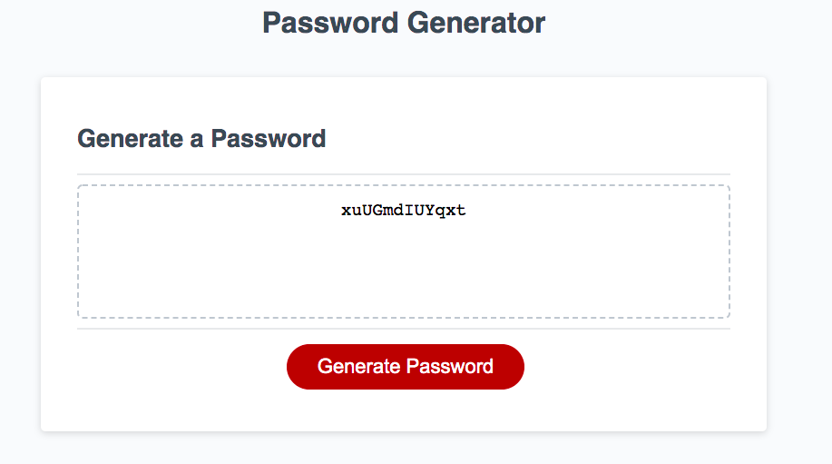

Homework for week 3 of bootcamp

This is the homework for the third week of bootcamp. It teaches the fundamentals of JavaScript through programming a password generator.

Installation
The website can be viewed on a internet browser.

Image

Usage
The website has no outside links or subpages. The only links are the three in the header, which direct the user down to specific parts of the page. In the future, the 'coming soon' pictures will be replaced with screenshots of completed works and links to them.

Credits
No collaborators

License
No license